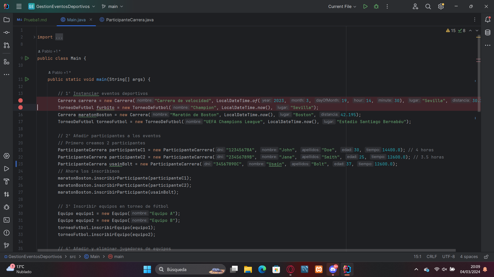

En esta prueba se comprobará que cuando sé instancian los eventos deportivos no ocurre ningún error
y funcione correctamente. Para ello usaremos dos puntos de ruptura uno en el objeto Carrera y otro en el objeto Torneo de futbol, 
de esta manera vemos que ambos objetos se crean correctamente. 

En el objeto tipo Carrera, vemos como pasa desde el constructor de la clase Carrera hasta el constructor de la clase 
